# stunnel

## stunnel配置
如果只是为一个服务使用stunnel，可以不用配置，只要给容器配置好以下环境变量，
* PIHIZI_CLIENT: yes | no 是客户端还是服务端
* PIHIZI_SERVICE: 服务名
* PIHIZI_ACCEPT: 服务监听的本地IP和端口
* PIHIZI_CONNECT: 服务转发的目标IP和端口

系统会为你生成默认配置
```stunnel.conf
foreground = yes
client = ${PIHIZI_CLIENT:-'yes'}
cert = /etc/stunnel/stunnel.pem
setuid = stunnel
setgid = stunnel
socket = l:TCP_NODELAY=1
socket = r:TCP_NODELAY=1
[${PIHIZI_SERVICE}]
accept = ${PIHIZI_ACCEPT}
connect = ${PIHIZI_CONNECT}
```

也可以使用自定义的配置文件，文件名为`stunnel.template`, 该文件映射到容器内的/etc/stunnel/目录下，替换默认的配置

## 启动stunnel-server
```yml
stunnel-server:
  container_name: pihizi-stunnel-server
  image: pihizi/stunnel:alpinelinux
  ports:
    - 50001:50001/tcp
  volumes:
    - ./etc/stunnel/server:/etc/stunnel:rw
  environment:
    - PIHIZI_CLIENT=no
    - PIHIZI_SERVICE=gearman
    - PIHIZI_ACCEPT=0.0.0.0:50001
    - PIHIZI_CONNECT=gearman-server:4730
  restart: always
  extra_hosts:
  - "gearman-server:172.17.0.1"
```

## 启动stunnel-client

💬 server启动后，会在etc/stunnel/server目录下生成一个stunnel.pem文件。需要将该文件复制到client的etc/stunnel/client目录下

```yml
stunnel-client:
  container_name: pihizi-stunnel-client
  image: pihizi/stunnel:alpinelinux
  ports:
    - 50002:50002/tcp
  volumes:
    - ./etc/stunnel/client:/etc/stunnel:rw
  environment:
    - PIHIZI_CLIENT=yes
    - PIHIZI_SERVICE=gearman
    - PIHIZI_ACCEPT=0.0.0.0:50002
    - PIHIZI_CONNECT=stunnel-server:50001
  restart: always
  extra_hosts:
  - "stunnel-server:172.17.0.1"
```

## 应用调用

```mermaid
sequenceDiagram
    participant server.app
    participant stunnel.server
    participant stunnel.client
    participant client.app

    client.app->>stunnel.client: 客户端希望连接到server.app
    stunnel.client-->stunnel.server: 加密通道
    stunnel.server->>server.app: 连接到server.app
    client.app-->server.app: 连城成功
```

